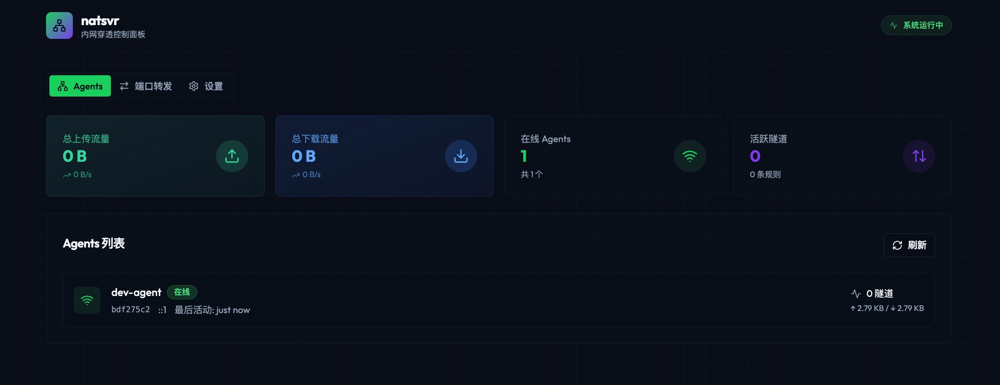

# natsvr - 内网穿透系统

一个基于 Golang 的内网穿透和网络共享系统，支持多 Agent 通过 Cloud 进行流量转发。



> 🚀 **企业版 & 专业版** 请访问 [natsvr.com](https://natsvr.com)

## 特性

- 多 Agent 互联互通
- 支持 TCP/UDP/ICMP 全协议转发
- WebSocket 隧道通信
- 可视化管理面板
- Token 认证
- 端口转发配置

## 架构

```
Agent A (内网1) <--WebSocket--> Cloud Server <--WebSocket--> Agent B (内网2)
                                    |
                            Dashboard (管理界面)
```

## 快速开始

### 安装

从 [Releases](https://github.com/vstaffs/natsvr/releases) 下载对应平台的二进制文件，或使用以下命令：

```bash
# Linux amd64
curl -Lo natsvr-cloud https://github.com/vstaffs/natsvr/releases/latest/download/natsvr-cloud-linux-amd64
curl -Lo natsvr-agent https://github.com/vstaffs/natsvr/releases/latest/download/natsvr-agent-linux-amd64
chmod +x natsvr-cloud natsvr-agent

# Linux arm64
curl -Lo natsvr-cloud https://github.com/vstaffs/natsvr/releases/latest/download/natsvr-cloud-linux-arm64
curl -Lo natsvr-agent https://github.com/vstaffs/natsvr/releases/latest/download/natsvr-agent-linux-arm64
chmod +x natsvr-cloud natsvr-agent
```

### 从源码编译

```bash
make build
```

### 运行 Cloud 服务器

```bash
./natsvr-cloud -addr :8080 -token your-secret-token

# 或使用配置文件 (支持 YAML/JSON)
./natsvr-cloud -config /etc/natsvr/cloud.yaml
```

配置文件示例 (`cloud.yaml`):

```yaml
# 监听地址
addr: :8080

# 管理员 Token
admin_token: your-secret-token

# 数据目录
data_dir: /var/lib/natsvr
```

### 运行 Agent

```bash
./natsvr-agent -server ws://cloud-server:8080/ws -token your-secret-token -name agent1
```

## 端口转发

通过 Dashboard 或 API 配置端口转发规则：

- **Local Forward**: 访问本地端口转发到远程 Agent
- **Remote Forward**: Cloud 公网端口转发到 Agent 内网服务
- **P2P Forward**: Agent 之间直接通信

## 开发

```bash
# 安装前端依赖
cd web && npm install

# 开发模式
make dev

# 构建
make build
```

## License

MIT

